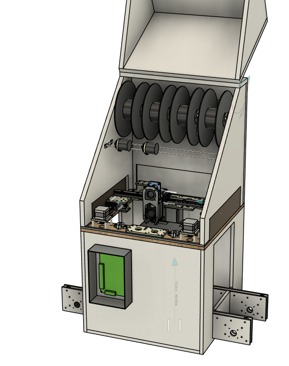
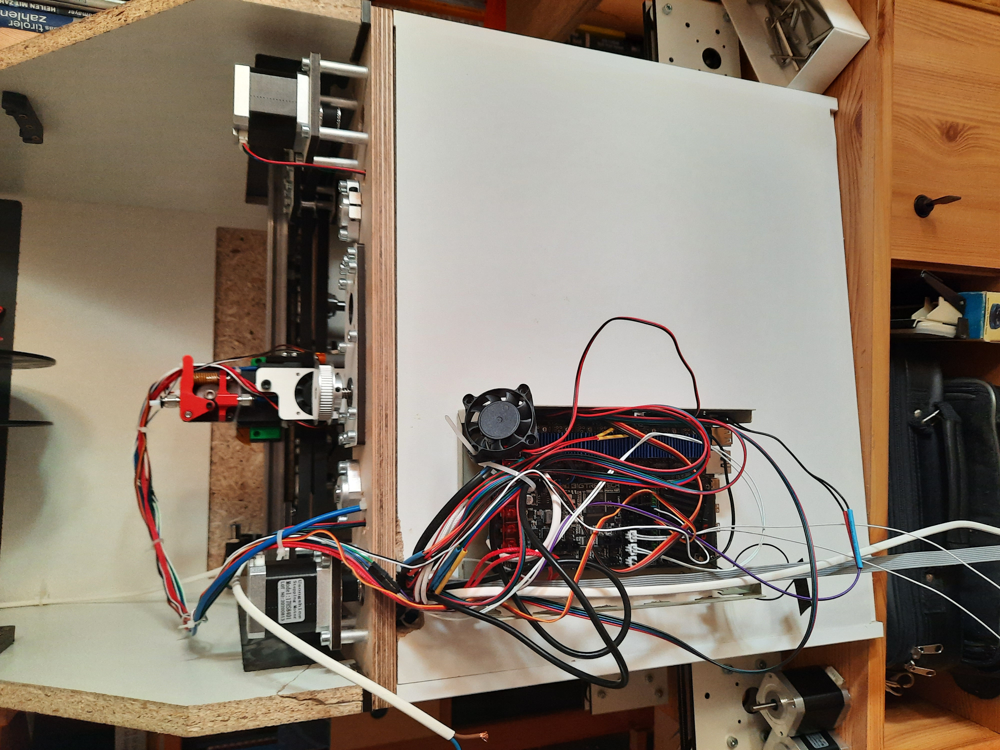
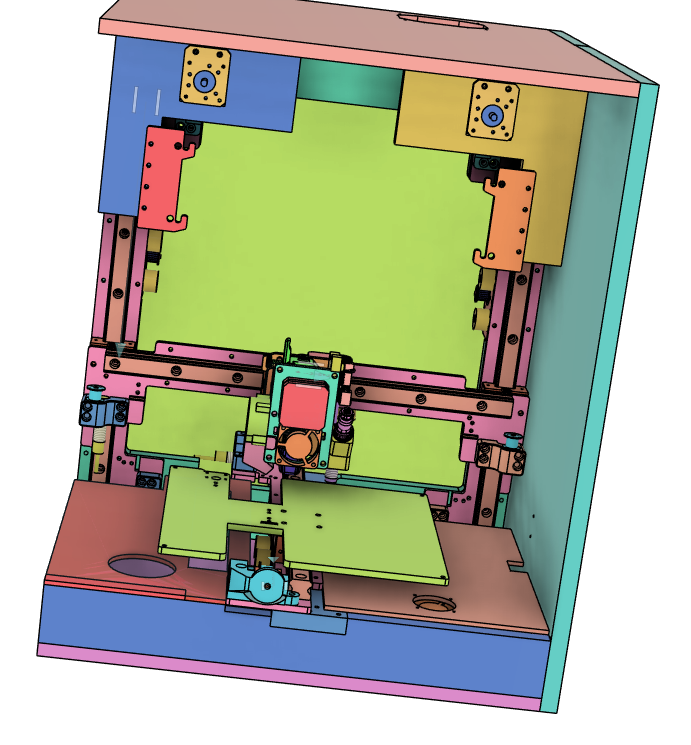
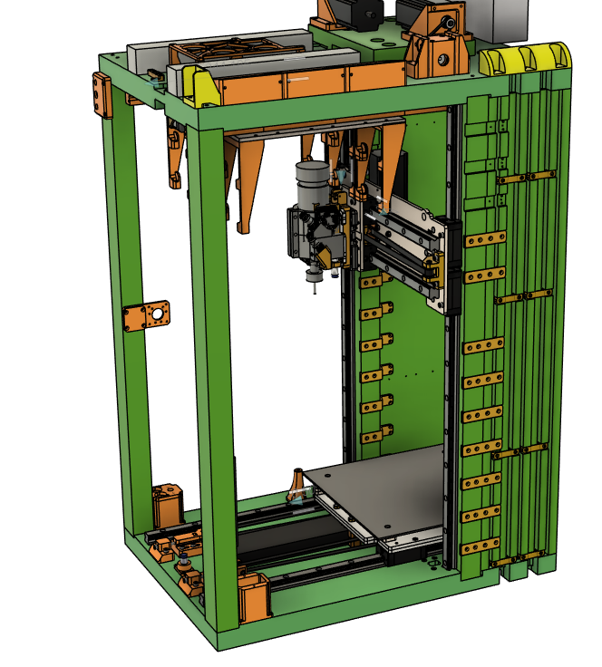
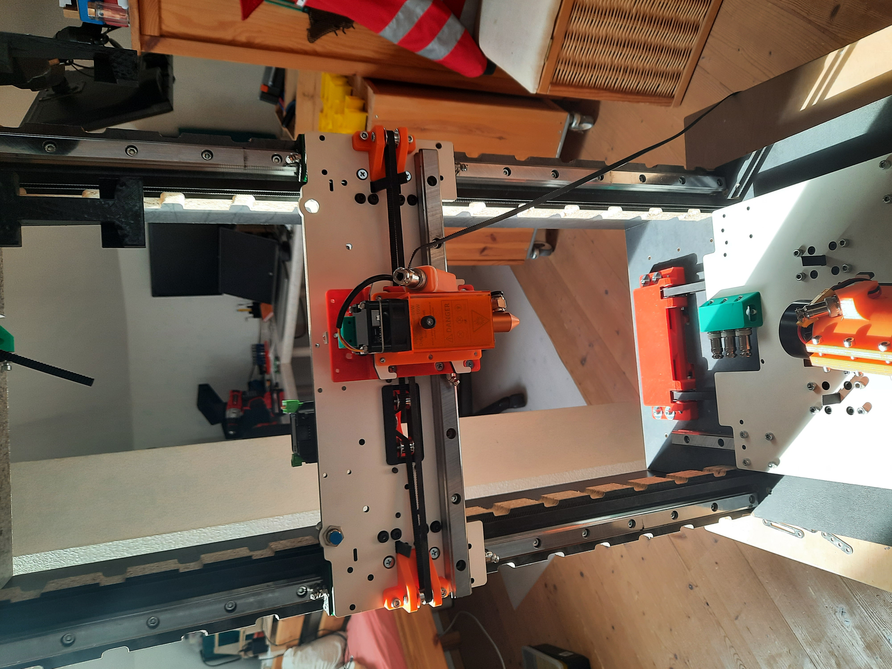
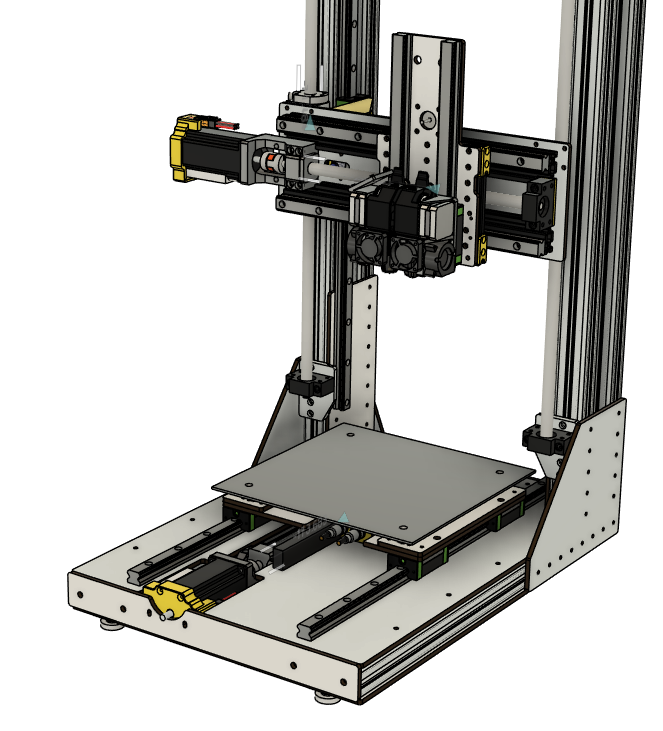
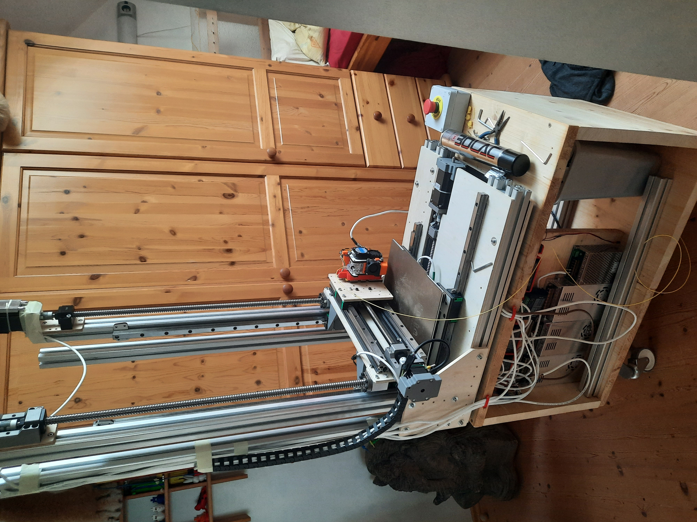
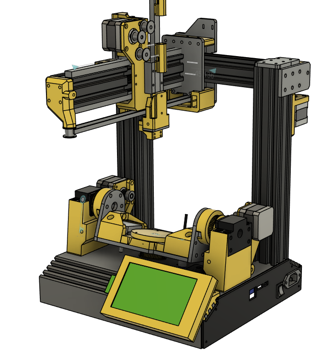
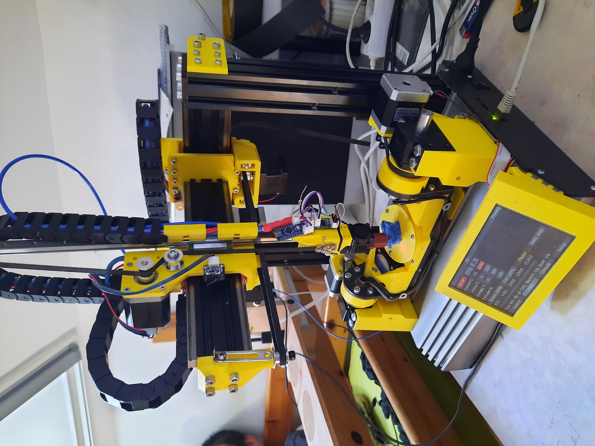

# Custom 3D Printers & Additive Manufacturing Prototypes

`mechatronics` · `Klipper` · `CAN bus` · `BigTreeTech Manta 8` · `iterative design`

A multi-year journey building custom 3D printers and toolchanging machines from scratch — solving problems no commercial printer could address at the time (bad part removal, multi-material printing, tool changing, non-planar slicing).

Today I use a **Bambu Lab P2S** for daily printing — its software integration is hard to beat. But the years spent building these machines taught me more about mechatronics, motion control firmware, and the discipline of shipping hardware than any course ever could. The last 20% takes 80% of the work.

I started with an **Ender 3** and a heavily modified **Ender 6**, which taught me the limits of bolting upgrades onto a consumer frame. Every machine below was a response to those limits.

---

## Timeline

| Project | Core idea | Drive | Key lesson |
|---------|-----------|-------|------------|
| **Bed-Switcher** | Belt-driven auto-swapping build beds | Belt | Mechanism ≠ system |
| **Toolchanger V1** | Linear-rail carriage tool interface | Belt + NEMA 17 | Precision must fail safely |
| **Toolchanger V2** | Modular toolheads over CAN bus | Belt + NEMA 23 | Closed-loop feedback matters |
| **Toolchanger V3** | Ball-screw precision, dual extruders | Ball screw + NEMA 23 | Architecture outlives hardware |
| **5A** | Custom 5-axis non-planar test platform | Linear rails + ball screws | Build the tool you need |

---

## Bed-Switcher — Automatic Belt-Driven Bed Swapping

A custom-built printer where the build plate is one of several swappable beds circulating on a belt-driven loop. Finished prints are ejected to a cooling station while a fresh, pre-heated bed indexes in — eliminating post-print removal entirely.

| | |
|---|---|
|  |  |

[▶ Watch the ejection cycle](images/bed-switcher/bed-switcher_working.gif)

**What worked:** Belt ejection, housing, frame.
**What didn't:** Heavy linear rails caused backlash from friction. Ejection holes in the heated bed created cold spots. Electromagnetic bed retention was binary (gap or clamp, nothing in between).
**Lesson:** A working mechanism is not a working system — every interface has to be designed for the full operating envelope.

---

##  Toolchanger V1 — Linear-Rail Carriage Interface

The whole toolhead rides on precision linear rails; a docking station locks it in place. The promise: industrial-grade repeatability by reusing the motion rail as the locating surface.

| | |
|---|---|
|  |  |

[▶ Watch the V1 dock](images/Toolchanger-T1/Toolchanger-T1_working.gif)

**What worked:** The kinematic concept.
**What didn't:** Any micro-misalignment caused the carriage to jam — and a jammed carriage could **drop the entire tool, hotend and stepper included, onto the print bed.** Open-loop control meant the printer had no way to detect a docking failure and would happily continue printing into the void. NEMA 17 motors on belt-driven Z needed a counterweight.
**Lesson:** Precision mechanisms must fail safely. A high-precision interface with a catastrophic failure mode is *worse* than a lower-precision one that always retains the tool.

---

##  Toolchanger V2 — CAN Bus & Modular Toolheads

Threw out V1's catastrophic docking geometry. Kept the multi-tool vision, rebuilt around closed-loop error detection, properly sized motors, and a radically simplified wiring architecture.

| | |
|---|---|
|  |  |

[▶ Watch the V2 swap](images/Toolchanger-T2/Toolchanger-T2_working.gif)

**Upgrades from V1:**

| Subsystem | V1 | V2 |
|-----------|----|----|
| Motors | NEMA 17 | Geared **NEMA 23** |
| Feedback | None (open loop) | Limit switches on every dock interface |
| Tool wiring | Bundles per tool | **CAN bus — 4 wires for up to 6 tools** |
| Drivers | Stock | TB6600 analog — loud, but functional |
| Toolheads | Extruder | Extruder + spindle + (planned) laser |

**The CAN bus decision is the single design choice I'm most proud of.** Each toolhead carried its own MCU and exposed itself as a CAN node — adding a tool became a software change, not a rewiring job. That abstraction outlived V2's mechanics and became the backbone of V3.

**Why abandoned:** No single fatal flaw — just accumulated shortcomings. Belts still backlash. Print-then-mill workflow needed more precision than belts could deliver. I bit the bullet and committed to doing it right.

---

##  Toolchanger V3 — Ball Screws, Final Iteration

V2's CAN architecture plus ball screws on every axis. Funded by my Zivildienst savings — this was the build where I refused to compromise on motion quality.

| | |
|---|---|
|  |  |

**Specs:**

- **Drives:** Ball screws on X / Y / Z
- **Toolhead:** Dual extruders on a single carriage (gantry was stiff enough to handle the mass without ringing)
- **Firmware:** Klipper on **BigTreeTech Manta 8**, CAN-bus toolheads
- **Trade-off:** Smaller build volume than the chassis footprint suggests, because I reused parts I already owned. Deliberate compromise: precision over envelope.

**Outcome:** The most precise and most reliable printer in this entire journey. It printed test parts successfully. It was the machine V1 and V2 were trying to become.

---

##  5A — Five-Axis Non-Planar Test Platform

A purpose-built 5-axis printer, designed from scratch as a testbed for non-planar slicing research. Most slicers force parts into stacks of 2D layers — a 5-axis machine can rotate the build platform or tool to deposit material along curved surfaces, enabling stronger parts and entirely new geometry.

| | |
|---|---|
|  |  |

**Status:** Working research instrument, not a finished product. The constraint has always been time, not capability.

---

##  Core Skills

| Firmware & Software | Mechanical & Hardware | Iterative Engineering |
|---|---|---|
| Klipper (Python + MCU) | Ball screws & linear rails | Failure-mode-driven redesign |
| CAN bus toolhead comms | Stepper sizing: NEMA 17 → NEMA 23 | Component reuse vs. design freedom trade-offs |
| Multi-MCU Klipper setups | Gantry alignment, kinematics | Closed-loop feedback integration |
| G-code, pressure advance, input shaper | Magnetic / pneumatic actuation | Fail-safe mechanical design |
| Custom slicer profiles & tool macros | Custom machined + printed frames | Knowing when to stop iterating |

---

##  Current Setup

For daily printing I use a **Bambu Lab P2S** — its software integration lets my family print without my involvement, which is a usability achievement I couldn't match in any of my custom builds. I keep the custom printers around as overflow capacity, for special jobs, and as a backup if the Bambu ever fails.

---

##  What I Took Away

- **Fail safely, always.** V1's catastrophic tool-drop is the lesson that defined every redesign after it.
- **Architecture outlives hardware.** The CAN bus abstraction from V2 became the backbone of V3.
- **The last 20% takes 80% of the work.** Knowing when a machine has taught you what it can — and walking away to start the next one — is itself an engineering skill.
- **Commercial products exist for a reason.** Standing on the shoulders of a polished integration is not surrendering; it's learning what "good" looks like.

